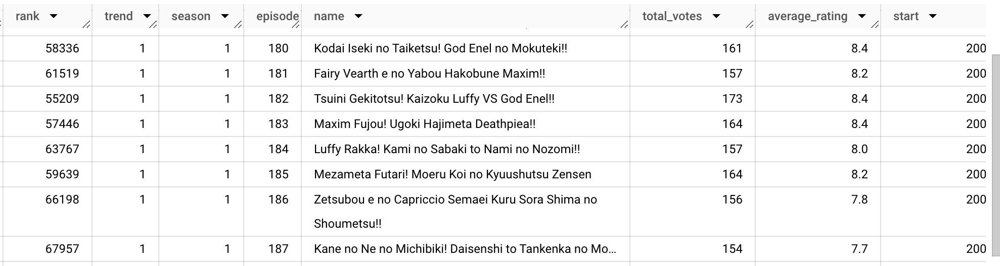
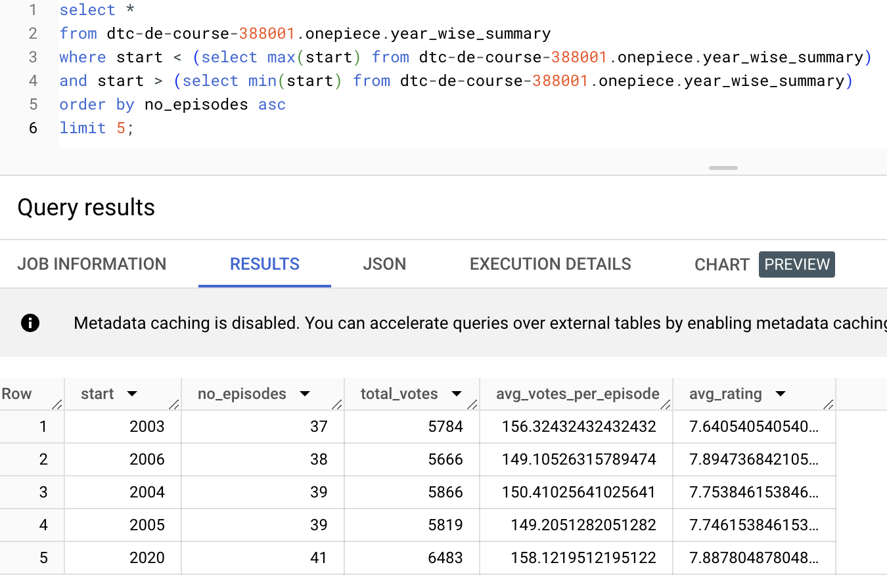
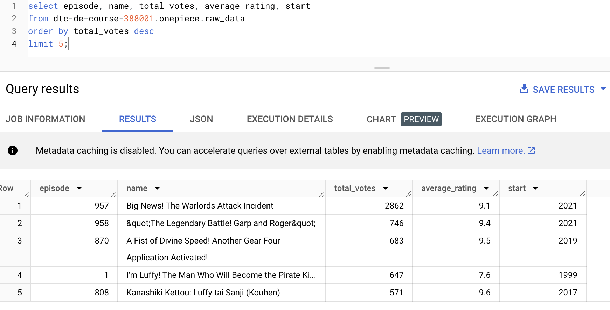
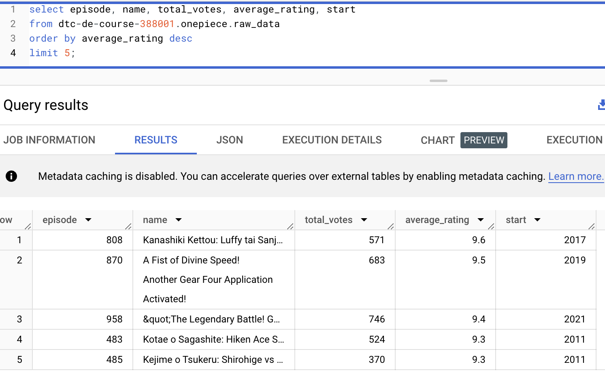

This repo is to track a Data Engineering project on a One Piece dataset. The purpose is to put into GCS (along with a couple of summarized outputs) and BigQuery for general availability, analyse the anime, popularity of its episodes and produce a trended view  over the years in Looker Studio for visualization.
Input Dataset is picked from [Kaggle](https://www.kaggle.com/datasets/aditya2803/one-piece-anime)



### Tech used:
- _Google Cloud Platform_
- [_PySpark_](./analysis_file.py)
- _GCS_ (to store input and output files)
    - _Python SDK_ to create bucket (if not exists) and upload the input file [Uploading local to GCS script](./uploading_local_to_GCS.py)
- [_Google Cloud DataProc_](./gcloud_commands.md) (to submit PySpark job)
- [_BigQuery_](./bigquery_commands.md) (for analysis)
- _Airflow_ (to seamlessly run dependencies)
- [_Looker Studio_](./Looker_studio_view.md) (for visualization)

### Findings and Insights
#### Years with the maximum _breaks_
```sql
select *
from dtc-de-course-388001.onepiece.year_wise_summary
where start < (select max(start) from dtc-de-course-388001.onepiece.year_wise_summary)
and start > (select min(start) from dtc-de-course-388001.onepiece.year_wise_summary)
order by no_episodes asc 
limit 5;
```


#### Top 5 most popular episodes in One Piece
```sql
select episode, name, total_votes, average_rating, start
from dtc-de-course-388001.onepiece.raw_data
order by total_votes desc
limit 5;
```



#### Top 5 highest rated episodes in One Piece
```sql
select episode, name, total_votes, average_rating, start
from dtc-de-course-388001.onepiece.raw_data
order by average_rating desc
limit 5;
```




#### Popularity Trend over the years
```sql
select 
    start as year,
    total_votes
from dtc-de-course-388001.onepiece.year_wise_summary
order by start asc;
```

We are seeing that Popularity dipped from 2000 to 2003 and then has stayed consistent over the years till 2020


### Summarized outputs (via PySpark)
Created via the script [pyspark_script](./analysis_file.py)
- Year-wise summary
- Overall summary for the show
- Actual data in partitioned format


### Links
- [Todos](/todos.md)
- [Questions to answer](./questions.md)
- [Gcloud commands](./gcloud_commands.md)
- [BigQuery commands](./bigquery_commands.md)
- [Looker visualizations](./Looker_studio_view.md)

