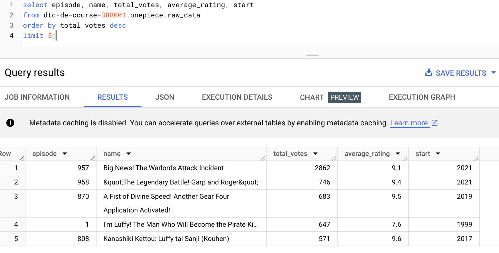

Creating an external table from parquet file stored in BigQuery
```sql
CREATE OR REPLACE EXTERNAL TABLE dtc-de-course-388001.onepiece.raw_data
WITH PARTITION COLUMNS
OPTIONS (
format = 'PARQUET',
uris = ['gs://onepiece-dtc-de-course-388001/onepieceanime/outputs/raw_data/*'],
hive_partition_uri_prefix = 'gs://onepiece-dtc-de-course-388001/onepieceanime/outputs/raw_data/',
require_hive_partition_filter = false
);
```


Record count
```sql
select count(1) as no_records 
from onepiece.raw_data;
```


Sample records
```sql
select *
from onepiece.raw_data
where start = 2004;
```


Creating external tables for year-wise summary for overall_summary
```sql
CREATE OR REPLACE EXTERNAL TABLE dtc-de-course-388001.onepiece.year_wise_summary
OPTIONS (
format = 'PARQUET',
uris = ['gs://onepiece-dtc-de-course-388001/onepieceanime/outputs/year_wise_summary/*.parquet']
);
```

```sql
CREATE OR REPLACE EXTERNAL TABLE dtc-de-course-388001.onepiece.overall_summary
OPTIONS (
format = 'PARQUET',
uris = ['gs://onepiece-dtc-de-course-388001/onepieceanime/outputs/overall_summary/*.parquet']
);
```


Years that had the maximum breaks (having the least number of episodes).

Generally one episode comes out per week, there should be ~52 episodes in a year, ideally.

Below query excludes the years where the show began and the max year of the show

```sql
select *
from dtc-de-course-388001.onepiece.year_wise_summary
where start < (select max(start) from dtc-de-course-388001.onepiece.year_wise_summary)
and start > (select min(start) from dtc-de-course-388001.onepiece.year_wise_summary)
order by no_episodes asc 
limit 5;
```


Top 5 most popular episodes in One Piece
```sql
select episode, name, total_votes, average_rating, start
from dtc-de-course-388001.onepiece.raw_data
order by total_votes desc
limit 5;
```



Top 5 highest rated episodes in One Piece
```sql
select episode, name, total_votes, average_rating, start
from dtc-de-course-388001.onepiece.raw_data
order by average_rating desc
limit 5;
```


